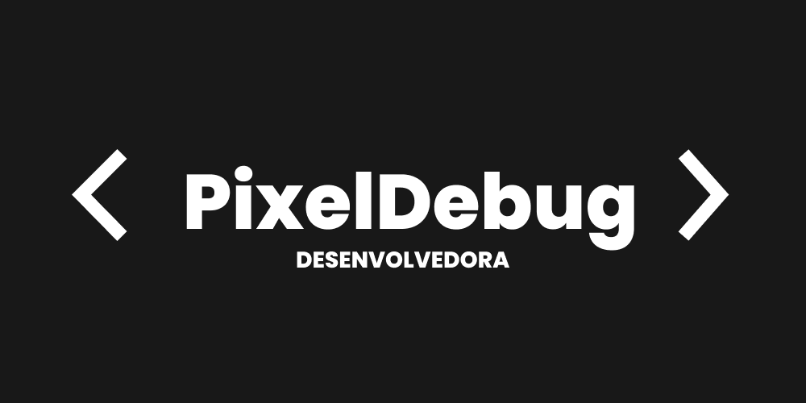

      
   
     

<h4 align="center">

Mais...

<h1 align="center">Oi meu nome é Marina </h1></img>

  
  

  
</a>

<h3 align="center">Trabalhando em:</h3>

  <a href="https://github.com/pixel-debug/pixel-debug">
    
    </img>
  </a>

<h3 align="center">Sobre mim:</h3>

  
  <a href="https://www.linkedin.com/in/marina-bernardes-diniz/">
    
  

<h5 align="center">"Attention. Hull failure imminent. All personnel abandon ship. Launch in 3...2...1..."</h5>
 
                    

